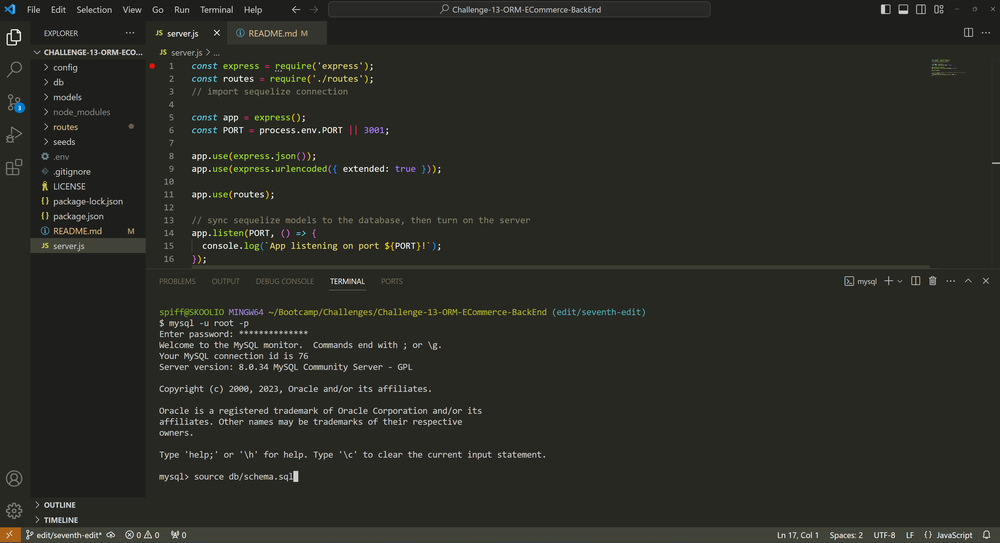

# Challenge-13-ORM-ECommerce-BackEnd

[](https://opensource.org/licenses/MIT)


## Description

This application can be used to build the backend of an onllne storefront with the ability to create, read, update, and delete products, categories and tags.


## Table of Contents
* [Description](#description)
* [Installation](#installation)
* [Usage](#usage)
* [Contributions](#contributions)
* [License](#license)
* [Questions and Contacts](#questions-and-contacts)


## Installation

[Visual Studio Code](https://code.visualstudio.com/), [GitBash](https://git-scm.com/downloads), [MySql Server](https://dev.mysql.com/downloads/mysql/) and [Node.js](https://nodejs.org/en) must be installed onto the user’s computer. The recommended version of Node.js 18.17.1 LTS.

[Instructions for installing MySql Server](https://coding-boot-camp.github.io/full-stack/mysql/mysql-installation-guide)

[Insomnia](https://insomnia.rest/download) also must be installed for the purposes of demonstrating this application. 

Once the required software has been successfully installed on the computer, clone this GitHub repository to a desired folder on the computer.

[The Repository of the E Commerce Backend](https://github.com/Hello-AndyJoe/Challenge-13-ORM-ECommerce-BackEnd)

In the cloned repository folder, create a `.env` file and include the MySQL Server password that was created when setting up MySQL server on the computer. 

```
DB_NAME="ecommerce_db"
DB_USER="root"
DB_PASSWORD= //MySQL Server password//
DB_HOST="localhost"
```

The cloned repository does not include the node_module folder containing the Dotenv, Express, Sequelize, or MySQL2 NPMs. Install them into the repository by running `npm i` in a GitBash terminal within Visual Studio Code. 


## Usage

To start using, open a terminal in the repository within Visual Studio Code. Enter `mysql -u root -p` and input the MySql Server password. Follow by entering `source db/schema.sql` 



Follow by opening a new GitBash and enter `npm run seed`, then enter `npm start`.

Next, open up the Insomnia program and create a New Request using `http://localhost.3001/api/products` to view all products. Additional requests will be shown in the walkthrough video below.

[Video Walkthrough of Ecommerical Back End](https://drive.google.com/file/d/1VH4dOrTxOJBnw5fmjmIdZ2V09koc0YFj/view?usp=sharing)


## Contributions

Starting code provided by the Full Stack Bootcamp.

[Sequelize.org](https://sequelize.org/v5/) and all activities of Module 13 - ORM were heavily referenced in the creation of the routes and models of this application.


## License

MIT


## Questions and Contacts
Visit other repositories created by me at [github.com/hello-andyjoe](https://github.com/hello-andyjoe)

If you have questions, please email me at [andrew.joseph.roper@gmail.com](mailto:andrew.joseph.roper@gmail.com)
